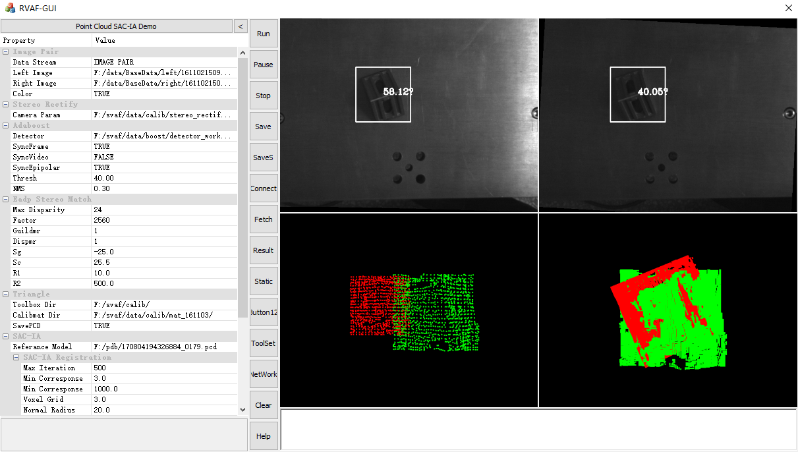

RVAF-GUI
===
MFC GUI Interface to drive [__RVAF__](https://github.com/P-Chao/RVAF)

* Left Zoon: Set parameter of algorithm
* Middle Zoon: Function Button
* Right Zoon: Visual Output

### Update Log ###

##### 2017/9/28 (Prevs) #####
1. 添加Proto文件配置读取模块
2. 添加进程启动、控制磨矿
3. 添加图像、点云数据传输模块
4. 适配9月28日编译的SVAF.exe

### Contact Author ###
[__Peng Chao__](http://www.p-chao.com)